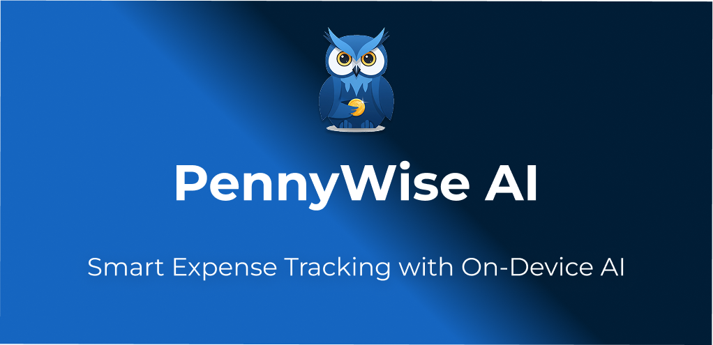
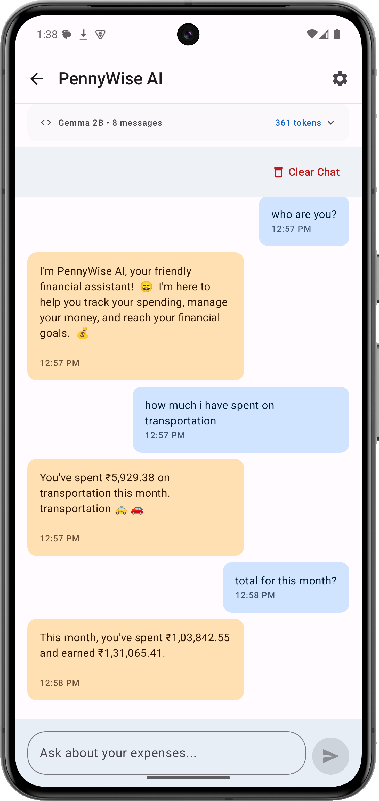

<a name="top"></a>
[](https://github.com/sarim2000/pennywiseai-tracker)
[](https://github.com/sarim2000/pennywiseai-tracker)
[](LICENSE)
[](https://developer.android.com/about/versions/12)
[](https://kotlinlang.org/)
[](https://developers.google.com/mediapipe)
[](https://forms.gle/7FTkx7Z6BAwqzWJE9)
[](https://github.com/sarim2000/pennywiseai-tracker/releases)
[](https://github.com/sarim2000/pennywiseai-tracker/commits)
[](https://discord.gg/eqbPUYSR)

⭐ **Star us on GitHub — help us reach 100 stars!**

[](https://x.com/intent/tweet?text=Check%20out%20PennyWise%20AI%20-%20Privacy-first%20expense%20tracker%20with%20on-device%20AI:%20https://github.com/sarim2000/pennywiseai-tracker%20%23Android%20%23PrivacyFirst%20%23OnDeviceAI)
[](https://www.linkedin.com/sharing/share-offsite/?url=https://github.com/sarim2000/pennywiseai-tracker)
[](https://www.reddit.com/submit?title=PennyWise%20AI%20-%20Privacy-first%20expense%20tracker&url=https://github.com/sarim2000/pennywiseai-tracker)
[](https://t.me/share/url?url=https://github.com/sarim2000/pennywiseai-tracker&text=Check%20out%20PennyWise%20AI)

## Overview

PennyWise automatically reads transaction SMS messages and transforms them into organized financial data using on-device AI. No manual entry, no cloud processing, complete privacy.

> ### 🚨 **BETA TESTING OPEN** 🚨
> 
> <a href="https://forms.gle/7FTkx7Z6BAwqzWJE9">
>   
> </a>
> 
> **Get early access** • Test new features first • Shape the future of PennyWise

## Key Features

- **🤖 Smart SMS Parsing** - Automatically extracts transaction details from any Indian bank SMS
- **📊 Spending Analytics** - Visual insights into your spending patterns and trends  
- **🔄 Subscription Tracking** - Detects and monitors recurring payments automatically
- **💬 AI Assistant** - Chat about your finances with a locally-running AI
- **🏷️ Auto-Categorization** - Intelligent grouping by merchant and transaction type
- **📤 Data Export** - Export as CSV or PDF for taxes or personal records

## Supported Banks

Currently supporting major Indian banks:

- **HDFC Bank**
- **State Bank of India (SBI)**
- **ICICI Bank**
- **Axis Bank**
- **Punjab National Bank (PNB)**
- **IDBI Bank**
- **Indian Bank**
- **Federal Bank**
- **Karnataka Bank**
- **Jupiter (CSB Bank)**
- **Amazon Pay (Juspay)**

More banks being added regularly! [Request your bank →](https://github.com/sarim2000/pennywiseai-tracker/issues/new?template=bank_support_request.md)

## Privacy First

All processing happens on your device using MediaPipe's LLM. Your financial data never leaves your phone. No servers, no uploads, no tracking.

## Screenshots

<table>
<tr>
<td></td>
<td></td>
<td></td>
<td></td>
<td></td>
</tr>
<tr>
<td align="center">Home</td>
<td align="center">Analytics</td>
<td align="center">AI Chat</td>
<td align="center">Subscriptions</td>
<td align="center">Transactions</td>
</tr>
</table>

## Quick Start

```bash
# Clone repository
git clone https://github.com/sarim2000/pennywiseai-tracker.git
cd pennywiseai-tracker

# Build APK
./gradlew assembleDebug

# Install
adb install app/build/outputs/apk/debug/app-debug.apk
```

### Requirements

- Android 12+ (API 31)
- Android Studio Ladybug or newer
- JDK 11

### Optional: Firebase Setup

<details>
<summary>Enable crash reporting</summary>

1. Create project at [Firebase Console](https://console.firebase.google.com)
2. Add app with package: `com.pennywiseai.tracker`
3. Download `google-services.json` to `/app`
4. Enable Crashlytics

</details>

## Tech Stack

<p align="center">

</p>

**Architecture**: MVVM • Room • Coroutines • MediaPipe AI • Material Design 3

## Contributing

See [CONTRIBUTING.md](CONTRIBUTING.md) for guidelines.

```bash
./gradlew test          # Run tests
./gradlew ktlintCheck   # Check style
```

## Contributors ✨

Thanks goes to these wonderful people ([emoji key](https://allcontributors.org/docs/en/emoji-key)):

<!-- ALL-CONTRIBUTORS-LIST:START - Do not remove or modify this section -->
<!-- prettier-ignore-start -->
<!-- markdownlint-disable -->
<table>
  <tbody>
    <tr>
      <td align="center" valign="top" width="14.28%"><a href="https://github.com/Lucifer1590"><br /><sub><b>Lucifer1590</b></sub></a><br /><a href="#community-Lucifer1590" title="Community Management">👥</a> <a href="https://github.com/sarim2000/pennywiseai-tracker/issues?q=author%3ALucifer1590" title="Bug reports">🐛</a> <a href="#userTesting-Lucifer1590" title="User Testing">📓</a></td>
    </tr>
  </tbody>
</table>

<!-- markdownlint-restore -->
<!-- prettier-ignore-end -->

<!-- ALL-CONTRIBUTORS-LIST:END -->

This project follows the [all-contributors](https://github.com/all-contributors/all-contributors) specification. Contributions of any kind welcome!

## License

MIT License - see [LICENSE](LICENSE)

---

<p align="center">
<a href="https://github.com/sarim2000/pennywiseai-tracker/releases">Download</a> •
<a href="https://github.com/sarim2000/pennywiseai-tracker/issues">Report Bug</a> •
<a href="https://github.com/sarim2000/pennywiseai-tracker/issues">Request Feature</a>
</p>
