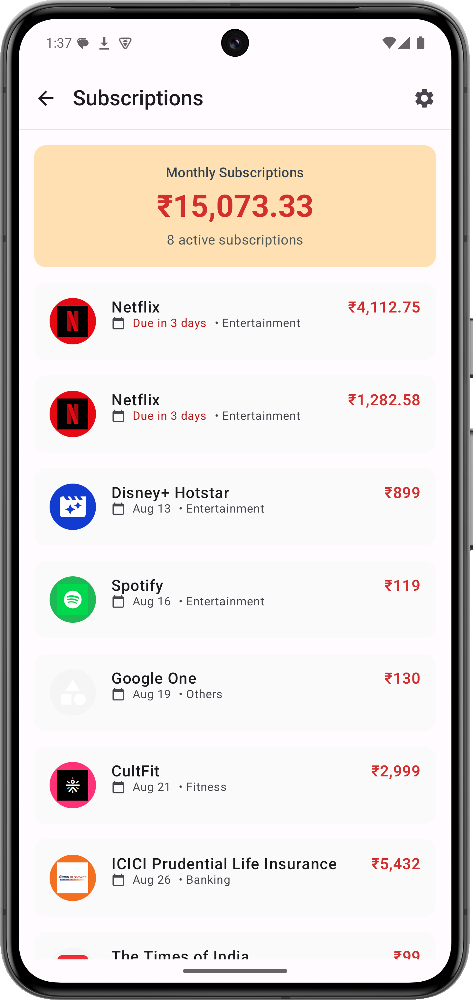

<div align="center">
  
  
  # PennyWise AI
  
  Transform your SMS transactions into financial insights with on-device AI
  
  <p>
    
    
    
    
  </p>
</div>

## Overview

PennyWise automatically reads transaction SMS messages and transforms them into organized financial data using on-device AI. No manual entry, no cloud processing, complete privacy.

## Key Features

- **🤖 Smart SMS Parsing** - Automatically extracts transaction details from any Indian bank SMS
- **📊 Spending Analytics** - Visual insights into your spending patterns and trends  
- **🔄 Subscription Tracking** - Detects and monitors recurring payments automatically
- **💬 AI Assistant** - Chat about your finances with a locally-running AI
- **🏷️ Auto-Categorization** - Intelligent grouping by merchant and transaction type
- **📤 Data Export** - Export as CSV or PDF for taxes or personal records

## Privacy First

All processing happens on your device using MediaPipe's LLM. Your financial data never leaves your phone. No servers, no uploads, no tracking.

## Screenshots

<table>
<tr>
<td></td>
<td></td>
<td></td>
<td></td>
</tr>
<tr>
<td align="center">Dashboard</td>
<td align="center">Analytics</td>
<td align="center">AI Chat</td>
<td align="center">Subscriptions</td>
</tr>
</table>

## Quick Start

```bash
# Clone repository
git clone https://github.com/sarim2000/pennywiseai-tracker.git
cd pennywiseai-tracker

# Build APK
./gradlew assembleDebug

# Install
adb install app/build/outputs/apk/debug/app-debug.apk
```

### Requirements

- Android 14+ (API 34)
- Android Studio Arctic Fox
- JDK 21

### Optional: Firebase Setup

<details>
<summary>Enable crash reporting</summary>

1. Create project at [Firebase Console](https://console.firebase.google.com)
2. Add app with package: `com.pennywiseai.tracker`
3. Download `google-services.json` to `/app`
4. Enable Crashlytics

</details>

## Tech Stack

<p align="center">

</p>

**Architecture**: MVVM • Room • Coroutines • MediaPipe AI • Material Design 3

## Contributing

See [CONTRIBUTING.md](CONTRIBUTING.md) for guidelines.

```bash
./gradlew test          # Run tests
./gradlew ktlintCheck   # Check style
```

## License

Apache License 2.0 - see [LICENSE](LICENSE)

---

<p align="center">
<a href="https://github.com/sarim2000/pennywiseai-tracker/releases">Download</a> •
<a href="https://github.com/sarim2000/pennywiseai-tracker/issues">Report Bug</a> •
<a href="https://github.com/sarim2000/pennywiseai-tracker/issues">Request Feature</a>
</p>
